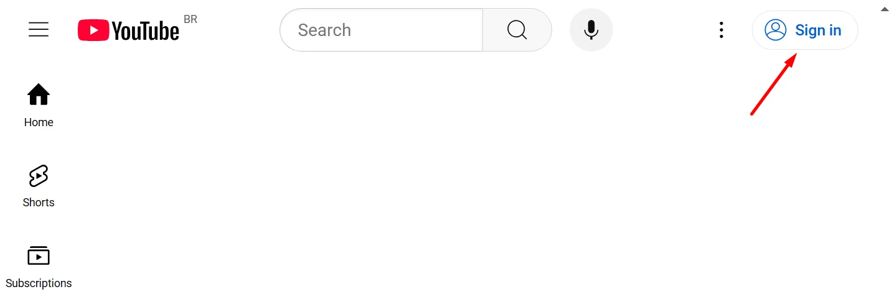
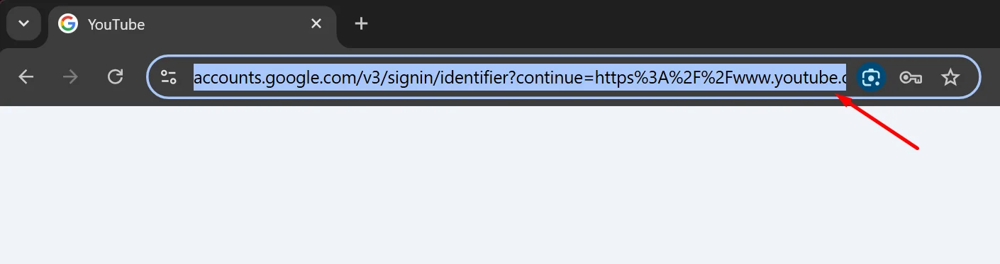
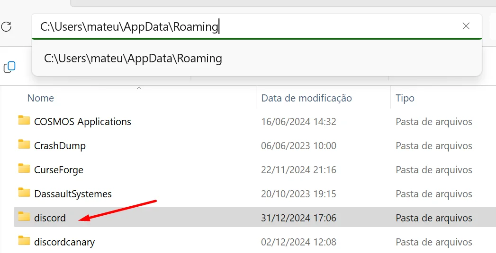
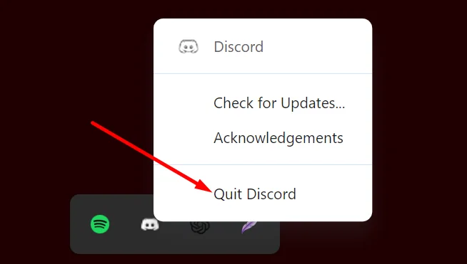
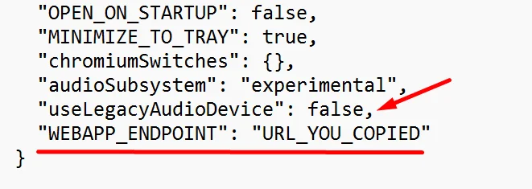
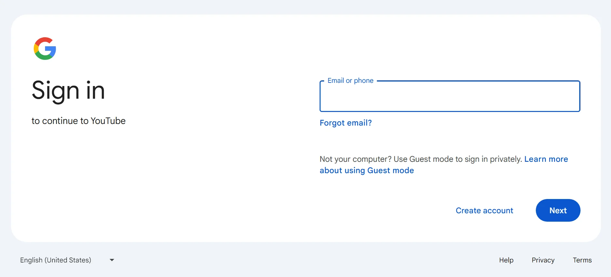
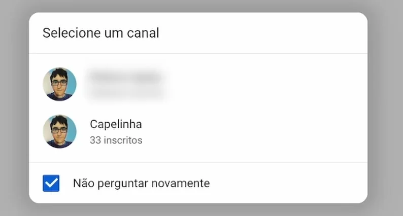

# How to avoid ads in Discord embeds using your YouTube Premium subscription

In recent months, ads in YouTube Embeds have become increasingly frequent and annoying. Fortunately, there’s an easy and effective way to connect your YouTube Premium account to Discord to block all these ads. This allows you to enjoy your videos without interruptions, both in chats and in Watch Together sessions with friends, ensuring a smoother and more enjoyable experience.

I'll leave a [support video](https://bit.ly/4gyeMJt) to make it easier to understand. Sorry for my English and my giant post, I tried to make it as clear as possible. I'm a poor autistic programmer from a third world country: 

Technically speaking, I found a way to configure Discord to open any website in the app window using a parameter called `"WEBAPP_ENDPOINT"`. This lets us access the YouTube login page and link your Discord account with YouTube Premium.

## 1. Get the YouTube Login Link

Since Discord’s window has some limitations, you can’t click links directly. So, we’ll use a direct link to make the process easier and ensure everything works.

1. Open an incognito tab in your favorite browser *(In Google Chrome and Edge, use the shortcut CTRL+SHIFT+N)*;
2. Type `youtube.com` and press "Enter";
3. Click on the *Login button* located in the top-right corner of the screen;



4. The Google login page will open. Copy the URL from the address bar;



5. Close the browser; you won’t need it anymore.

The link looks like the one below. Don't use my link, create your own to avoid problems.

`https://accounts.google.com/v3/signin/identifier?continue=https%3A%2F%2Fwww.youtube.com%2Fsignin%3Faction_handle_signin%3Dtrue%26app%3Ddesktop%26hl%3Dpt%26next%3Dhttps%253A%252F%252Fwww.youtube.com%252F&ec=65620&hl=pt-BR&ifkv=AeZLP9-B2WPkDIicNMd8QnWbEtou2IBL7L9hP--Br1PYgbO1YmhzjVX_DiQNuMpTxoYWUdFpRlr9Mw&passive=true&service=youtube&uilel=3&flowName=GlifWebSignIn&flowEntry=ServiceLogin&dsh=S-1895556158%3A1735676385839979&ddm=1`

## 2. Find the Discord Configuration File

Now that we have the login link, we need to configure the `"WEBAPP_ENDPOINT"` parameter in Discord’s configuration file, located in the folder `C:\Users\YourName\AppData\Roaming\discord\`.

*If you’re using Discord PTB or Canary, there will be folders with the respective names in the Roaming directory.*

The easiest way to access the configuration directory is to type `%appdata%` in the Windows search bar and press Enter. From there, navigate to the Discord folder.

1. Press the "Windows" key on your keyboard;
2. Type `%appdata%` and press Enter.



## 3. Edit the *settings.json* File

Now it’s time to configure the parameter in Discord’s settings file. You’ll find this file in the folder you just accessed, named `settings.json`. You can use any text editor; I recommend the *Windows Notepad*.

> Before continuing, ensure that Discord is maximized, occupying the full screen of your monitor. Then, close it by clicking the "X". Check the system tray to see if it’s still running. If it is, right-click the icon and select `Quit Discord`.

1. Locate the `settings.json` file, right-click on it, and select to edit with Notepad;
2. Add a comma on the last line before the closing braces `}`;
3. Add a new line before the closing braces `}` with the text `"WEBAPP_ENDPOINT": "URL_YOU_COPIED"`;
4. Replace *URL_YOU_COPIED* with the text you copied from the browser’s address bar;

> Pay attention to the formatting to avoid corrupting the file. Don’t forget the double quotes around the parameter name and the URL you replaced. Also, don’t forget the comma on the previous line.



5. Save the file by going to `File > Save` or using the shortcut `CTRL+S`;



6. Close Notepad.

The file should look something like this:

```
{
  "BACKGROUND_COLOR": "#202225",
  "IS_MAXIMIZED": false,
  "IS_MINIMIZED": true,
  "WINDOW_BOUNDS": {
    "x": 160,
    "y": 78,
    "width": 1130,
    "height": 692
  },
  "OPEN_ON_STARTUP": false,
  "MINIMIZE_TO_TRAY": true,
  "chromiumSwitches": {},
  "audioSubsystem": "experimental",
  "useLegacyAudioDevice": false,
  "WEBAPP_ENDPOINT": "https://accounts.google.com/v3/signin/identifier..."
}
```

## 4. Log in with Your Google Account

When you open Discord, you’ll see the Google login page - we’re almost there! Log in with the account that has the YouTube Premium subscription.

This step involves simply entering your email and password, completing two-step verification, and hoping for the best.



After logging in, you’ll be redirected to YouTube. If you have multiple channels, a window will appear for you to select the channel where your video viewing history will be stored.

Select the option not to ask again which channel to use and double-click the desired channel name.



> Due to the previously mentioned limitation on links, clicking the channel name may not seem to do anything, but the configuration will be saved.

To close the window, go to the system tray icon, right-click it, and select `Quit Discord`.

## 5. Undo the Configuration File Modification

Now that you’ve successfully logged into YouTube, you need to remove the `WEBAPP_ENDPOINT` parameter from Discord’s configuration file.

1. Reopen the `settings.json` file, right-clicking on it and selecting to edit with Notepad;
2. Delete everything you added earlier. Make sure to remove the comma on the line above `WEBAPP_ENDPOINT`;
3. Save the file by going to `File > Save` or using the shortcut `CTRL+S`;
4. Close Notepad.

The file should revert to something like this. You can copy it if you prefer:

```
{
  "BACKGROUND_COLOR": "#202225",
  "IS_MAXIMIZED": false,
  "IS_MINIMIZED": true,
  "WINDOW_BOUNDS": {
    "x": 160,
    "y": 78,
    "width": 1130,
    "height": 692
  },
  "OPEN_ON_STARTUP": false,
  "MINIMIZE_TO_TRAY": true,
  "chromiumSwitches": {},
  "audioSubsystem": "experimental",
  "useLegacyAudioDevice": false
}
```

## 6. Open Discord Again

Done! Now, when you open Discord, you can enjoy a much smoother experience without the annoyance of ads in videos. Have fun watching and interacting without interruptions!

This solution has been working perfectly for months. I imagine you may need to repeat the login process eventually.

I haven’t tested this on Linux yet, but there’s a good chance it will work if you locate the corresponding configuration file.

